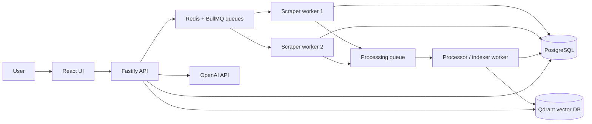

# Distributed RAG Web Scraper — 5-Day Project Plan

## Goal

Build and demonstrate a small but real distributed web-scraping system. It will crawl approved websites, process and version their content, index it for semantic search, and answer questions with source citations.

This plan prioritizes a working, explainable submission over unnecessary complexity. Complete the **must-have** items first; treat the optional items as bonus work only after the core system works.

## Final System



### Workflow

1. A user submits a permitted starting URL to the API.
2. The API creates a crawl job in Redis/BullMQ.
3. Any independent scraper-worker container can claim the job.
4. The worker checks `robots.txt`, applies a per-domain delay, fetches the page, stores raw HTML, and queues processing.
5. The processor cleans and validates the content, detects whether it changed, creates a version if needed, chunks it, and indexes chunks in Qdrant.
6. For a question, the API retrieves relevant chunks, asks the LLM to answer *only from those chunks*, and returns the answer plus source URLs.

## Recommended Stack

| Need | Choice | Why this is practical in 5 days |
|---|---|---|
| Language | TypeScript + Node.js | One language across API, workers, and UI. |
| Monorepo | npm workspaces | Simple shared types and one repository. |
| API | Fastify | Fast, compact, typed, easy to document. |
| Queue | BullMQ + Redis | Jobs persist; supports retries, backoff, and multiple workers. |
| Static scraping | Axios + Cheerio | Lightweight and fast for HTML pages. |
| JavaScript scraping | Playwright | Renders pages that require JavaScript. |
| Relational data | PostgreSQL + Prisma | Reliable structured storage and simple migrations. |
| Vector search | Qdrant | Docker-friendly and designed for embeddings. |
| Embeddings + answers | OpenAI API | Best time-to-working-RAG; use an environment variable for the key. |
| UI | React + Vite | Small dashboard with minimal setup. |
| Containers | Docker Compose | Lets every service run independently and supports scaling demos. |
| Tests / CI | Vitest + GitHub Actions | Enough automated evidence without slowing development. |

### Alternatives you can explain in the report

- **Python/Scrapy:** mature scraping ecosystem, but TypeScript avoids switching languages and integrates naturally with BullMQ and React.
- **RabbitMQ/Kafka:** powerful, but more operational overhead than BullMQ for this project.
- **pgvector:** a valid simpler option, but Qdrant makes the vector-search component explicit and independently deployable.
- **Ollama/local LLM:** avoids API cost but may require hardware and setup time; OpenAI is more reliable for a short deadline.

## Scope and Websites

Use only sites whose robots rules and terms allow your intended access. Keep request volume low and document the date you checked each policy.

| Requirement | Suggested target | What to demonstrate |
|---|---|---|
| Mostly static HTML | `https://quotes.toscrape.com` | Axios + Cheerio extraction. |
| JavaScript-rendered | A permitted demo site such as `https://web-scraping.dev` | Playwright rendering and extraction. |
| Many pages / pagination | `https://books.toscrape.com` | Pagination discovery; crawl a bounded, polite sample and use measured throughput to demonstrate the practical equivalent of 500+ pages. |

Before using any target, manually review its `robots.txt` and terms. Do **not** bypass access controls, CAPTCHA, logins, or rate limits. Limit the live demo crawl to an approved, polite size (for example 25–100 pages) unless the site explicitly permits more. For the 500+-page requirement, state and evidence this in the report: **“Practical equivalent: projected from measured throughput on a bounded, polite crawl with 1 and 3 workers.”** Include page count, duration, throughput, retry/failure counts, and the extrapolated 500-page duration; label the projection clearly as an extrapolation, not an observed result.

## Repository Layout

```text
distributed-rag-scraper/
├── apps/
│   ├── api/                 # Fastify routes: crawl, pages, search, QA, jobs
│   └── web/                 # React dashboard
├── services/
│   ├── scraper-worker/      # Fetch, robots, rate limits, discovery
│   └── processor-worker/    # Clean, version, chunk, embed, index
├── packages/
│   └── shared/              # Types, schemas, queue names, utilities
├── prisma/                  # Schema and migrations
├── docs/                    # Architecture, measurements, report assets
├── docker-compose.yml
├── .env.example
└── README.md
```

## Data Model (minimum)

- `sites`: domain, crawl settings, robots status, last robots check.
- `pages`: canonical URL, site ID, latest content hash, status, last fetched time.
- `page_versions`: page ID, raw HTML, clean text, title, extracted tables/links JSON, content hash, fetched time.
- `chunks`: version ID, ordinal, text, heading/path, Qdrant point ID.
- `crawl_runs`: starting URL, status, pages discovered/completed/failed, timestamps.

Keep raw HTML and cleaned content separate. A new `page_versions` row is created only when the cleaned-content hash differs from the latest version.

## Five-Day Schedule

### Day 1 — Foundation and one simple crawl

**Goal:** have the full local environment running and successfully save one static page.

1. Create the Git repository and make an initial commit.
2. Create the monorepo folders and shared TypeScript configuration.
3. Add Docker Compose services for PostgreSQL, Redis, Qdrant, API, scraper worker, processor worker, and UI.
4. Add `.env.example`; never commit actual API keys.
5. Create the Prisma schema and run the first migration.
6. Build a `POST /crawl` endpoint that validates a URL and creates a crawl job.
7. Build one scraper worker that uses Axios + Cheerio on the static site and saves raw HTML plus title/text to PostgreSQL.
8. Add a `GET /health` endpoint and a basic README run guide.

**End-of-day proof:** `docker compose up` starts the stack; submitting one static URL creates a database record.

**Commit checkpoint:** `feat: bootstrap stack and static crawl persistence`

### Day 2 — Distributed scraping, politeness, and resilience

**Goal:** turn the single scraper into a distributed queue-driven crawler.

1. Define `crawl` and `process` BullMQ queues.
2. Move fetching out of the API: API enqueues; worker consumes.
3. Add URL normalization, same-domain discovery, visited-URL deduplication, and a crawl-depth/page-limit setting.
4. Add robots.txt checking and a per-domain delay. Record skipped URLs and the reason.
5. Configure retries for transient failures: 3 attempts with exponential backoff.
6. Route permanently failed jobs to a named failed/dead-letter queue; expose failures in `GET /jobs`.
7. Add Playwright fetch mode for the approved JavaScript target, selected by crawl configuration.
8. Run at least two scraper-worker containers and show both consuming jobs.

**End-of-day proof:** pagination creates more jobs; two workers share them; a forced timeout retries and eventually appears in the failed queue.

**Commit checkpoint:** `feat: distributed crawl workers with retries and robots compliance`

### Day 3 — Processing, versioning, and semantic index

**Goal:** transform raw pages into clean, searchable knowledge.

1. Build the processor worker consuming the process queue.
2. Remove scripts, styles, navigation, and obvious boilerplate; preserve title, headings, text, links, and HTML tables where possible.
3. Validate normalized output with Zod.
4. Implement incremental re-crawls before a full download: skip URLs fetched within a configured freshness window, and for older URLs send conditional `If-None-Match` / `If-Modified-Since` requests when a previous ETag / Last-Modified value exists. On `304 Not Modified`, record the check and skip processing; otherwise continue with the full fetch.
5. Hash cleaned text as a fallback when HTTP validators are absent or unreliable. If it is unchanged, mark the fetch as unchanged; otherwise create a new page version.
6. Chunk by headings/paragraph boundaries, targeting roughly 300–600 tokens with a small overlap (about 50 tokens).
7. Generate embeddings and store vector points in Qdrant with metadata: URL, title, page/version/chunk IDs, heading, and crawl date.
8. Implement keyword search in PostgreSQL and semantic search in Qdrant.

**End-of-day proof:** a processed page has chunks in Qdrant and searches return a URL and text excerpt; a re-crawl either skips a fresh page, receives `304 Not Modified`, or detects unchanged content without creating a duplicate version.

**Commit checkpoint:** `feat: versioned processing and semantic indexing`

### Day 4 — RAG API and simple UI

**Goal:** let a user crawl, search, and ask grounded questions through a polished interface.

1. Finish API endpoints:
   - `POST /crawl` — create a crawl run.
   - `GET /jobs/:id` — crawl/job progress and failures.
   - `GET /pages` and `GET /pages/:id` — saved data and version history.
   - `GET /search?q=&mode=keyword|semantic|hybrid` — ranked result excerpts.
   - `POST /qa` — answer and citations.
2. Implement hybrid retrieval: combine top semantic and keyword results, deduplicate by chunk, and choose the best 5–8 chunks.
3. Write a strict QA prompt: answer only from supplied context; say that information is unavailable when unsupported; attach the source URL(s) used.
4. Build a small React UI with three screens/tabs: Crawl, Search, and Ask a Question.
5. Display job status, retrieved excerpts, answer, and clickable citations.
6. Add error and loading states.

**End-of-day proof:** you can ask a question whose answer requires two crawled sources and see citations to both.

**Commit checkpoint:** `feat: grounded QA API and dashboard`

### Day 5 — Testing, measurements, documentation, and demo rehearsal

**Goal:** make the submission defensible and easy to evaluate.

1. Write unit tests for URL normalization, robots decisions, retry classification, cleaner, hash/version behavior, and chunking.
2. Add one integration test for enqueue → scrape → process using a controlled local HTML fixture.
3. Add GitHub Actions to run install, lint, tests, and Docker build on pushes.
4. Measure scaling with the same controlled, bounded crawl:
   - Run A: 1 scraper worker.
   - Run B: 3 scraper workers.
   - Record page count, elapsed time, completed/failed jobs, and throughput.
   - Project the duration for 500 pages from each observed throughput. In the report, call this a **practical-equivalent extrapolation from a bounded, polite crawl**, not a claim that 500 pages were actually fetched.
5. Demonstrate failure recovery: stop one worker during a multi-worker crawl; show remaining workers continue and the job is recovered/retried.
6. Evaluate retrieval quality with 8–10 prepared questions. For each, record whether a relevant source appears in the top 5 results and whether citations support the answer.
7. Prepare diagrams, screenshots, the report, and a narrated video walkthrough.
8. Tag the final version and verify a clean setup from the README instructions.

**End-of-day proof:** a reviewer can start the project, crawl content, search it, ask a cited question, and inspect evidence of scaling and failure recovery.

**Commit checkpoint:** `docs: add evaluation, report, and demo evidence`

## Implementation Order (do not skip ahead)

1. Make Docker Compose and PostgreSQL work.
2. Save one static HTML page in the database.
3. Put that task behind BullMQ.
4. Start two worker containers and confirm the same queue feeds both.
5. Add politeness, retries, and failure handling.
6. Add JavaScript rendering and pagination discovery.
7. Add cleaning, validation, content hashing, and versions.
8. Add chunking, embeddings, Qdrant, and search.
9. Add the QA endpoint with citations.
10. Add the UI only after the API works in Postman/curl.
11. Test, measure, document, and rehearse.

## Must-Have Checklist

- [ ] Dockerized API, worker(s), Redis, PostgreSQL, and Qdrant
- [ ] At least three approved target sites / crawl modes demonstrated
- [ ] Static and JavaScript rendering paths
- [ ] Pagination or multi-page discovery
- [ ] Multiple independently started worker containers
- [ ] robots.txt, rate limits, retries, exponential backoff, and dead-letter handling
- [ ] Raw data, cleaned data, hashing, and page versions
- [ ] Incremental re-crawls: freshness window, ETag/Last-Modified conditional requests when available, and `304 Not Modified` handling
- [ ] Structured extraction beyond plain text (tables and/or links)
- [ ] Semantic retrieval and grounded QA with URL citations
- [ ] API and basic React UI
- [ ] Scaling measurement and worker-failure demonstration
- [ ] Tests, CI, README, diagrams, report, and video

## Optional Enhancements (only if the checklist is complete)

- Prometheus/Grafana monitoring dashboard.
- Scheduled incremental re-crawls (the required incremental checks are already implemented; this enhancement automates their schedule).
- Domain-specific rate-limit configuration in the UI.
- Reciprocal Rank Fusion for more formal hybrid ranking.
- Authentication and multi-user crawl projects.

## Report and Video Outline

1. **Problem and goal:** explain the system in one minute.
2. **Architecture:** show the diagram and explain why the API, queues, workers, databases, and UI are separate.
3. **Scraping/compliance:** approved sites, robots checks, domain delays, and limits.
4. **Reliability:** retries, exponential backoff, dead-letter jobs, and worker-crash recovery.
5. **Processing/RAG:** cleaning, versioning, heading-aware chunks, embeddings, retrieval, and citations.
6. **Live demo:** submit crawl, show workers/jobs, search content, ask a cited question.
7. **Evidence:** scaling table, 500-page practical-equivalent throughput extrapolation, incremental re-crawl results, failure demonstration, and retrieval evaluation.
8. **Technology choices:** what you chose, alternatives considered, and trade-offs.
9. **Limitations/future work:** honest next improvements.

## What “Good” Looks Like

You do not need thousands of pages or a beautiful product. A strong submission is one where every major claim is visible:

- Two or more worker containers visibly process a queue.
- A crash does not silently lose the job.
- The system refuses/skips disallowed URLs and slows itself per domain.
- Re-crawling skips fresh pages or uses HTTP validators where available; unchanged content does not create duplicate versions.
- Every AI answer links back to the retrieved page(s).
- Your report includes actual bounded-crawl measurements; any 500-page estimate is clearly labelled as a throughput-based practical-equivalent extrapolation.

Start Day 1 by getting the simplest path working: one static URL → queue → worker → PostgreSQL. Everything else is an extension of that successful path.
